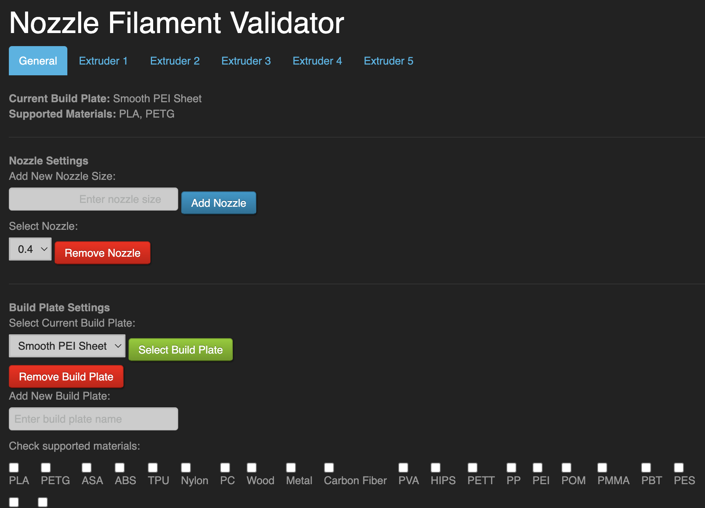
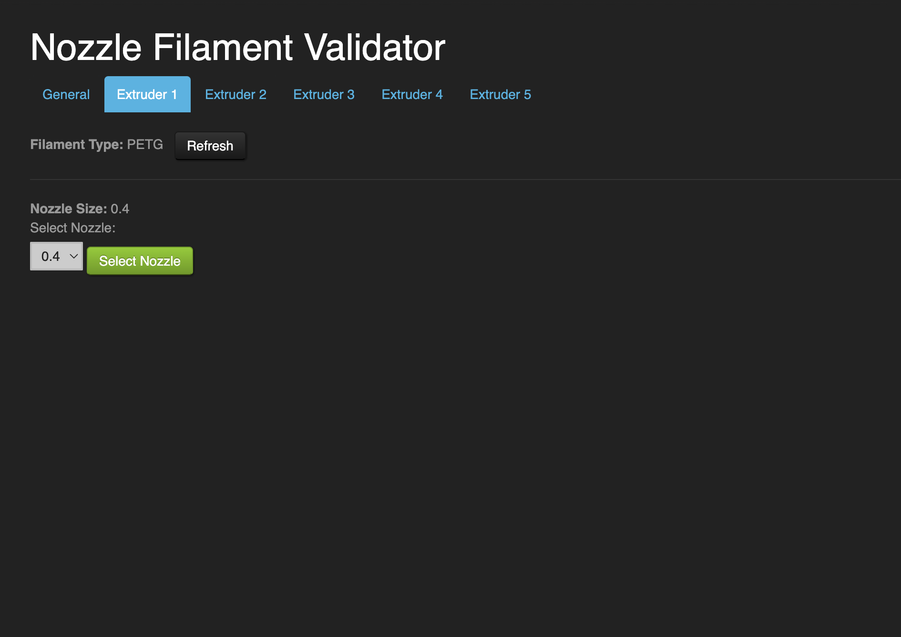
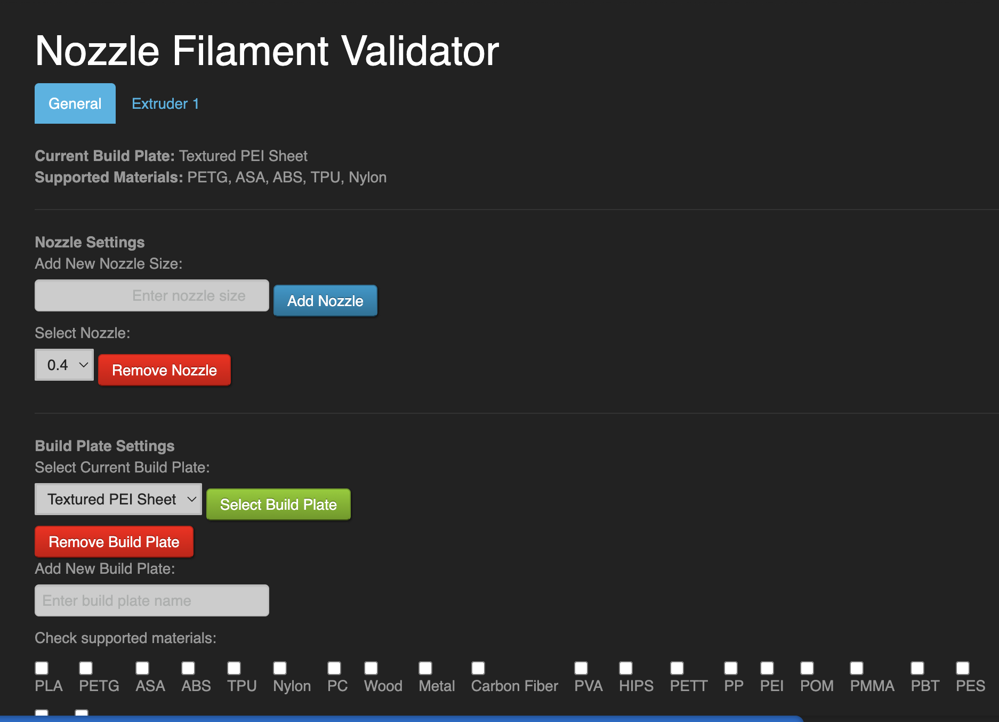
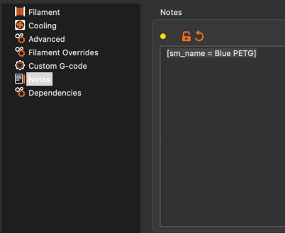

# OctoPrint-Nozzle-Filament-Validator

This plugin validates slicer profile, nozzle size (for each extruder), build plate, and filament type (for each
extruder) before starting a print.
It uses the slicer config present in the gcode to work, it is not a replacement for checking yourself but can help to
prevent simple
mistakes from occurring

Settings page with multiple extruders:

Settings page for extruder 1:

Settings page for 1 extruder:

## Setup

Install via the bundled [Plugin Manager](https://docs.octoprint.org/en/master/bundledplugins/pluginmanager.html)
or manually using this URL:

    https://github.com/Rylan-Meilutis/OctoPrint-Nozzle-Filament-Validator/archive/master.zip

## Needed plugins

- [Spool Manager](https://plugins.octoprint.org/plugins/SpoolManager/) - This plugin will
  automatically set the filament type for the spool if you have it installed and have set
  the filament type for the spool.

## Slicer Compatibility

This plugin is currently known to be compatible with the Prusa slicer. 
It may work with other slicers but has not been tested. 
If you are having issues with a slicer feel free to start a discussion and I will see what I can do.

## Configuration

Make sure the printer model is set in the printer profile. This is used to determine whether gcode has been sliced for
your printer.
(if you get a message saying the printer model is wrong, you can copy the printer model from the error message if you
know you sliced the gcode correctly and paste it into the printer profile).

Go to plugin settings and set your nozzle size for each extruder (or extruder 1 if you have a single tool head machine,
and build plate.

Filament type should be set automatically if you have spool manager installed and have set
the filament type for the spool.
If you do not have spool manager installed, filament type will not be checked.

If using a plugin that runs a .gcode file such as the continuous print queue plugin, You can skip gcode validation for
that file by adding
<code>; skip_validation</code> in the bottom 1000 lines in the gcode file (This works on all .gcode files so be careful
when using it).

When you go to print, the plugin will check if the gcode settings match the settings you
have set, and that the current filament is supported by the selected build plate. If it
does not match, it will notify you of the error. If it does match, it will notify you of a
successful validation.

## Multi Extruder Support

When configured in octoprint, this plugin supports multi material printers. It will check filament type on each extruder
and nozzle size on each extruder (if your printer has more than 1 nozzle). It will also check the build plate for all
filaments being used. If any of the extruders do not match the settings, it will notify you of the error and cancel the
print.

## Spool selection

<b>This option is disabled by default</b>

<b>* This feature is case-sensitive *</b>

As of current, the plugin can check that the correct spool is loaded in each extruder.
This is done by checking the database id of the spool in the spool manager plugin.
If the correct spool is not loaded, it will notify you of the error and allow you to pick between three options:
Confirm the correct spool is loaded (this will switch the loaded spool in spool manager),
cancel the print, or ignore the incorrect spool (will continue the print with the current loaded spool).
With either selection, the filament type will be checked after the spool is selected or ignored,
so filament type checking remains the same.

There is also a timeout that can be adjusted in the settings.
This is the time in seconds that the plugin will wait before failing the print.

### Slicer config

Using this requires the slicer to be set up correctly.
The plugin will look for the following settings in the notes section of the filament profile in the gcode
<code>[sm_name = (filament name)]</code> (the brackets are essential for the plugin to find the setting)
(Note: you cannot have brackets [] in the name of your filament.)

Image of the settings in Prusa slicer:

## In Development

Nothing major at the moment, just bug fixes, removing unused functions, and other minor improvements.

## Coming Soon

- Add the ability to scan the gcode before starting a print to verify the settings
- Add the ability to auto scan new files for compatability when they are uploaded and remove them if they are not
  compatible
- Add the ability to scan all files and remove ones that aren't compatible

