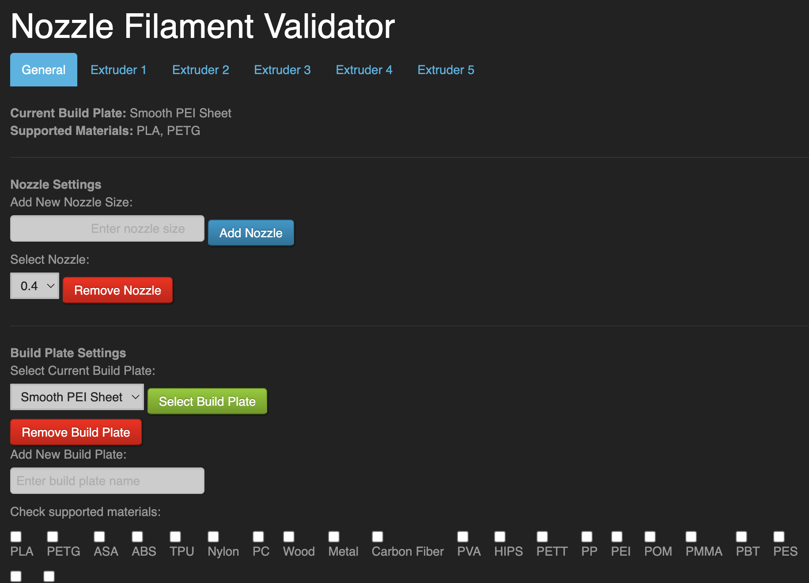
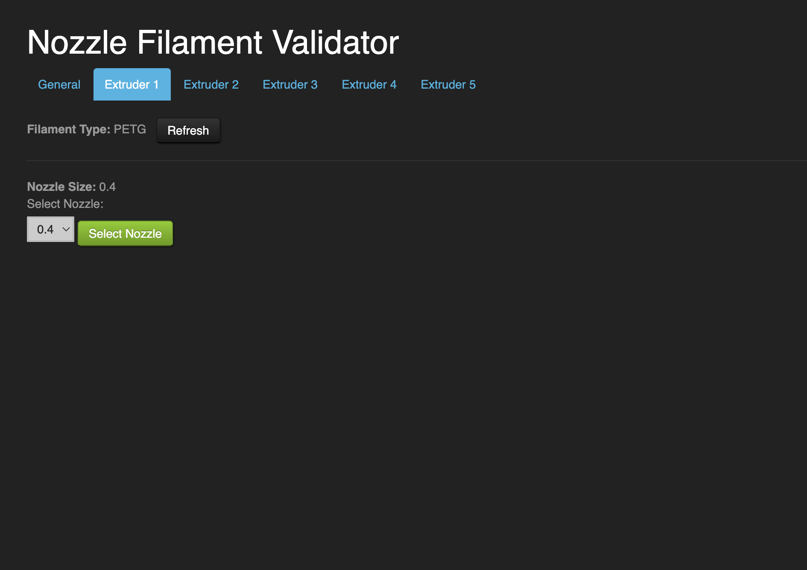
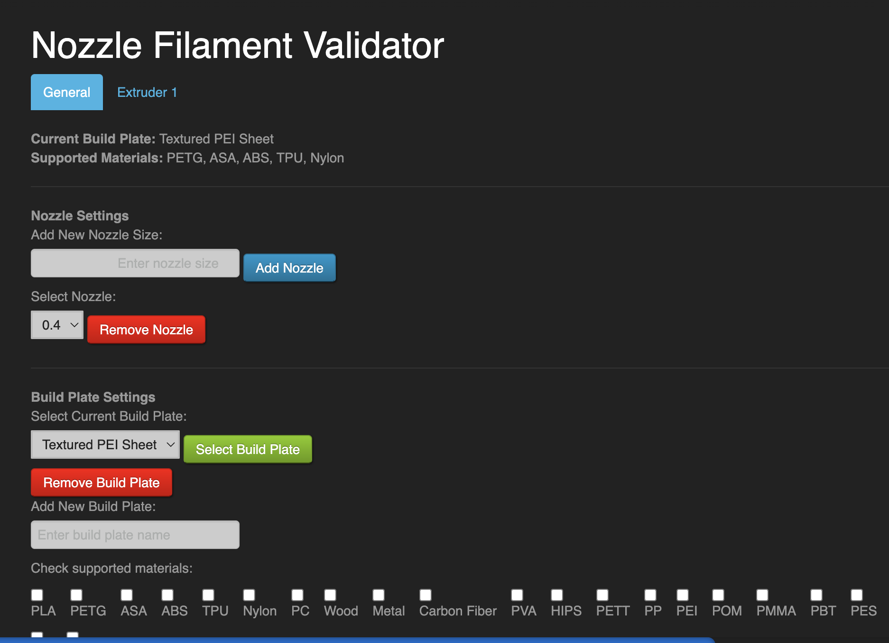
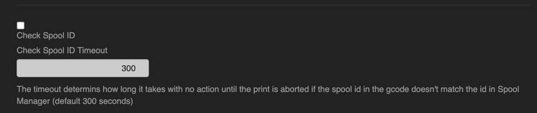
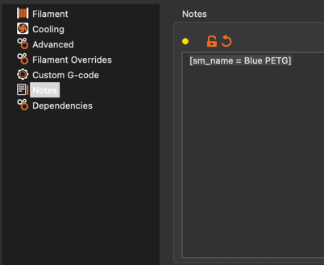

# OctoPrint-Nozzle-Filament-Validator

This plugin validates slicer profile, nozzle size (for each extruder), build plate, and filament type (for each
extruder) before starting a print.

When OctoPrint RME Compatibility supplies a logical-to-physical tool mapping,
validation runs after mapping confirmation and checks each logical slicer tool
against the selected physical tool's nozzle and SpoolManager assignment.
It uses the slicer config present in the gcode to work, it is not a replacement for checking yourself but can help to
prevent simple
mistakes from occurring

Settings page with multiple extruders:

Settings page for extruder 1:

Settings page for 1 extruder:

## Setup

Install via the bundled [Plugin Manager](https://docs.octoprint.org/en/master/bundledplugins/pluginmanager.html)
or manually using this URL:

    https://github.com/Rylan-Meilutis/OctoPrint-Nozzle-Filament-Validator/archive/master.zip

## Needed plugins

- [Spool Manager](https://plugins.octoprint.org/plugins/SpoolManager/) - This plugin will
  automatically set the filament type for the spool if you have it installed and have set
  the filament type for the spool.

## Slicer Compatibility

This plugin is currently known to be compatible with the Prusa slicer. 
It may work with other slicers but has not been tested. 
If you are having issues with a slicer feel free to start a discussion and I will see what I can do.

## Configuration

Make sure the printer model is set in the printer profile. This is used to determine whether gcode has been sliced for
your printer.
(if you get a message saying the printer model is wrong, you can copy the printer model from the error message if you
know you sliced the gcode correctly and paste it into the printer profile).

Go to plugin settings and set your nozzle size for each extruder (or extruder 1 if you have a single tool head machine,
and build plate.

Filament type is set automatically when SpoolManager or the OctoPrint Spoolman plugin is installed
and its selected spools have materials configured. Without either plugin, select the loaded material
for each extruder on the plugin settings page. These manual selections allow filament-type validation
to continue, but filament/spool-name validation requires SpoolManager or Spoolman.

For Spoolman, the unique `spoolman:<id>` identifier shown on each extruder tab is used for optional
spool-name validation. Add it to the slicer's filament notes in the same format, for example
`[sm_name = spoolman:123]`.

If using a plugin that runs a .gcode file such as the continuous print queue plugin, You can skip gcode validation for
that file by adding
<code>; skip_validation</code> in the bottom 1000 lines in the gcode file (This works on all .gcode files so be careful
when using it).

When you go to print, the plugin will check if the gcode settings match the settings you
have set, and that the current filament is supported by the selected build plate. If it
does not match, it will notify you of the error. If it does match, it will notify you of a
successful validation.

Validation runs in OctoPrint's GCODE queuing phase. The first command belonging to the
print job is held until validation succeeds; when validation fails, job commands are
suppressed and the print is cancelled. This backend gate also applies to prints started
through OctoPrint's API or another plugin, not only the web UI. Files on the printer's SD
card cannot be validated because OctoPrint cannot read their contents, so those jobs are
blocked by the validation gate.

If metadata is missing, unreadable, malformed, or does not match the configured printer,
the plugin displays a warning with **Continue anyway** and **Cancel print** choices. No
response before the configured validation timeout is treated as cancellation, so the gate
remains fail-closed. Pending validation and spool-selection prompts are returned to clients
that connect or reload during the timeout, with the remaining response time rather than a
new timeout.

Filament validation has two independent settings: **Validate filament types** compares the
material type reported by SpoolManager, while **Validate filament/spool names** checks the
`sm_name` value from filament notes. Either check can be disabled without disabling the
other nozzle, build-plate, printer-model, or tool-count checks.

### Early file validation

Version 3.3.0 can validate local G-code before print start. Enable **Validate local G-code
files when uploaded** to check each newly uploaded machine-code file automatically, or use
the checkmark button on any local G-code row in OctoPrint's Files panel to validate it on
demand. Files stored on the printer's SD card do not show the button because OctoPrint
cannot read them for validation.

A successful result is stored with the file and reused at print start, including after an
OctoPrint restart. It is reused only when the file's size and modification/change timestamps
and the complete validation configuration still match. Printer-profile, build-plate,
extruder/nozzle, SpoolManager filament/name, validation-setting, and logical-to-physical tool
mapping changes all force a normal pre-print validation instead.
Choosing **Continue anyway** or ignoring a spool mismatch applies only to that validation
request and is never stored as a reusable success.

## Multi Extruder Support

When configured in octoprint, this plugin supports multi material printers. It will check filament type on each extruder
and nozzle size on each extruder (if your printer has more than 1 nozzle). It will also check the build plate for all
filaments being used. If any of the extruders do not match the settings, it will notify you of the error and cancel the
print.

## Spool selection

<b>This option is disabled by default</b>

<b>* This feature is case-sensitive *</b>

As of current, the plugin can check that the correct spool is loaded in each extruder.
This is done by checking the name of the spool in the spool manager plugin.
If the correct spool is not loaded, it will notify you of the error and allow you to pick between three options:
Confirm the correct spool is loaded (this will switch the loaded spool in spool manager),
cancel the print, or ignore the incorrect spool (will continue the print with the current loaded spool).
With either selection, the filament type will be checked after the spool is selected or ignored,
so filament type checking remains the same.

There is also a timeout that can be adjusted in the settings.
This is the time in seconds that the plugin will wait before failing the print.

### Slicer config

Using this requires the slicer to be set up correctly.
The plugin will look for the following settings in the notes section of the filament profile in the gcode
<code>[sm_name = (filament name)]</code> (the brackets are essential for the plugin to find the setting)
(Note: you cannot have brackets [] in the name of your filament.)

Image of the settings in Prusa slicer:

### Post-Processor
Having a different filament profile for each spool can be a pain, especially if you have a lot of spools. 
So a post-processing script has been developed to make it easier to add the spool data to the gcode. 
This is not required to use the plugin, but it can make it easier to manage your spools.
Information on how to use the post-processor can be found [here](https://github.com/Rylan-Meilutis/Nozzle-Filament-Post-Processor/)

## In Development

Nothing major at the moment, just bug fixes, removing unused functions, and other minor improvements.

## Coming Soon
-  ** Add the ability to change the spool type in the gcode from the octoprint webui.

- Add the ability to scan all files and remove ones that aren't compatible
